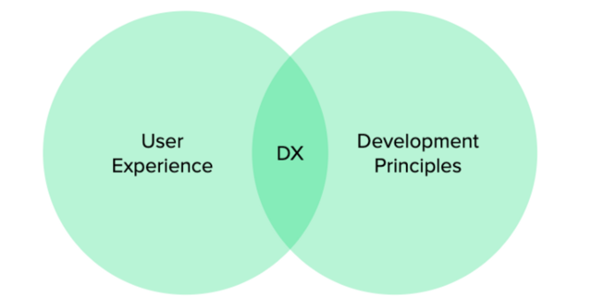

# DX

## intro

`DX`는 `Developer eXperience`(개발자 경험)의 약어이다. UI/UX는 많이 들어봤지만 DX는 무슨 뜻일까?

## UI/UX

개발자들은 다양하게 생겨나고 있는 디지털 제품들 가운데, 사용자에게 보다 양질의 서비스를 제공하고 여타 서비스에 대해 경쟁력을 갖추기 위해 `UI/UX`를 신경써서 서비스를
만들어낸다.

`UI`는 사용자가 제품/서비스를 사용할 때 `시각적으로 확인할 수 있는 부분`으로, 제공되는 `서비스의 디자인, 폰트, 칼라, 레이아웃 등` 다양한 부분들을 아우른다.

`UX`(사용자의 경험)는 사용자가 직접 `서비스를 이용하면서 느끼는 종합적인 만족도`를 말한다. UX가 좋으려면 UI, 서비스의 편리성, 속도, 서비스 유지·보수, 접근성 등
다양한 요소들이 충족돼야 한다.

---

## DX

DX(개발자 경험)는 `제품의 기본 사용자가 개발자` 라고 상정한 경우, UX와 동일하다. 즉, 개발자를 대상으로 한 서비스에 대해 개발자들이 이용하면서 느끼는 만족감을 총칭하는
말이라 생각하면 되겠다.

DX에는 개발과 관련된 제품, 라이브러리, SDK, 문서, 프레임 워크, open source 솔루션, API, 기타 도구 등이 포함될 수 있다.

DX는 UX가 중요한 것과 같은 이유로 중요하다. 좋은 DX를 찾은 개발자는 더욱 만족하며 서비스를 이용할 수 있으며, 더 많이 홍보해 제품을 더 오래 사용할 것이다. 이 부분은
개발자를 대상으로한 서비스 생산자(이 역시 개발자일 수 있음)의 입장에서 더욱 고려해야 할 사항이라 볼 수 있다.

### DX 향상?

개발자 입장에서 DX가 높다는 건 어떤 걸 의미할까? 대상이 개발자이니만큼, `DX가 높은 것`은 `개발자의 업무 효율성과 어느정도 비례`한다고도 볼 수 있다.

그렇다면 개발자들이 스스로 DX를 높일 수도 있는 것 아닐까? (즉, DX를 높인다는 건 업무의 효율을 향상시킨다는 것)

→ `DX를 향상(개선) ≒ 개발자 업무의 효율 향상`

---

### DX 개선 요소들

어느정도 공식 표준으로서 따르고 있는 방법론들이 존재하지만, 함께 업무를 하는 집단에 따라서 사용하는 언어, 방법들이 다소 차이가 있을 수 있다. 아래 요소들을 정하는 궁극적인
목표가 업무 효율의 향상이니만큼, 꼭 공식 표준만을 따라야 하는 것은 아니다.

하지만

1. **IDE code style**

2. **coding규칙 (coding convention)**

   google과 같은 몇몇 IT기업들은 coding convention들을 공유하는데, 이러한 공신력 있는 규칙들을 참고하도록 하자.

   [Toast_ui coding convention](https://ui.toast.com/fe-guide/ko_CODING-CONVENTION#%EC%84%A0%EC%96%B8%EA%B3%BC-%ED%95%A0%EB%8B%B9)

   [Google naming convention](https://cloud.google.com/apis/design/naming_convention)

3. **git commit message 맞추기**

   Reference [Udacity](https://udacity.github.io/git-styleguide/)

4.

... *더 알게되면 추가할 예정*

---

Reference [DX](https://no-kill-switch.ghost.io/dx-stands-for-developer-experience/)

**내가 이해한 DX를 깨작깨작 정리해 보았다...** 