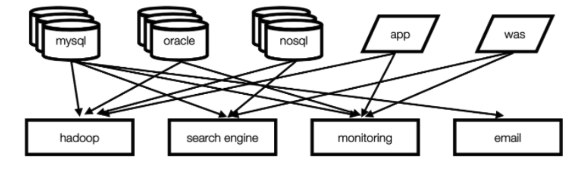

## Apache Kafka

### 定義　| Apache Kafkaは?

大容量、大規模メッセージデータを早く処理するために開発した分散メッセージングプラットフォーム

> kafkaはアプリ間メッセージ交換のために使われるメッセージングシステム

LinkedInで開発されて2011年オープンソースで公開された

Apache　Kafkaはビックデータを分析する時いろんなストーレジと分析システムにデータを連結するための必須ツールで認識され、データパイプライン構築時主に使われるオープンソースソルション

> メール : 発信者は受信者とは関係なくメールサーバーにメッセージを送信できる
> 送ったメッセージはメールサーバーに保存され、受信者は自分が確認したい時いつでもメールで確認できる
> 
> Kafkaもこういう流れと似てる。Producerはkafkaでメッセージを送信、そのメッセージはkafkaに保存される。そしてConsumerはkafkaに保存されてるメッセージを必要な時使える
 
### なんでApache Kafkaを使うのか

Source Application : データ送信、ターゲットアプリ : データ受ける → 一方向だが、ソース・ターゲットがどんどん多くなる

* リアルタイムトランザクション(OLTP)処理と非同期処理が同時に行われるが、統合転送領域の不在で複雑度が増加
* パイプラインの管理が難しい。特定の部分を修正する時、前のノードを全部修正しないといけない

* Point to Point Structure vs Kafka Structure

 
だからkafkaが発信者と受信者を連結する。

* 発信者(Publish) : Kafkaにデータを伝送だけしたらOK、誰が受けるか気にしなくていい
* 受信者(Subscribe) : 受信者はKafkaにほしいトピックを購読する

つまり誰が送ったか気にせず、必要なメッセージだけ購読する方式
以前point-to-point構造に比べて単純でメインテナンス、エラー対応、ネットワークトラヒックの利点も得られる

### 構造｜kafkaアーキテクチャー
 
#### Kafka導入前(Point-to-Point方式)
- Point to Pointの方式はキューを通じて伝えるメッセージを送ると、受信者がキューでメッセージを使う
- FIFOキューのように、受け取る人はみんな一つずつキューを持っていて、送る人が目的地キューに渡すと、受け取る人が取り出して読む。
→ データ連動の複雑度が増加

既存のデータストアバックエンド管理、バックエンドによってフォーマット、別にアプリ開発が必要だった

つまり、データ転送ラインが多くなる → 配布・障害対応が難しくなる → データフォーマット変更時メインテナンスしづらい

### Kafka導入後(Pub/Sub方式)

* 中にTopicがある
* 購読者が特定トピックやイベントに購読をしておけば、当該トピックやイベントに対する通知を非同期方式で受ける
* すなわち、PublisherがTopicにメッセージを送ると、そのtopicを購読しているすべてのユーザにメッセージが転送される。
→ ProducerとConsumerを分離して大量処理可能、scale-out可能

#### 違い

* Point to Pointの方式はメッセージをそれぞれ1名のユーザーのみ受けることができるが
  Pub/Sub方式ではトピックを購読した多くのユーザーがメッセージを受け取ることができる
* Point to Pointの方法はメッセージを受信した人がキューから取り出して読む方法だが、
  Pub/Sub方式はトピックから引き出すのではなく、トピックからBroadCastされる方式。 ユーザーにメッセージが通知される概念

#### Kafka方式の長所

* Kafkaにだけデータを転送したら必要なとこで各自受け取れる
* Kafkaが提供してる標準フォーマットに繋がってデータを送受信負担が減る

### Kafkaの要素

* `Topic` : キューのようなもの、kafkaの中にtopicがある。つまりProducerとConsumerがKafkaに送った自分のメッセージを区分するための名前。  
  多数のProducerとConsumerが同じKafkaを使うとメッセージが混ぜられるため、Topicで区分する

* `Producer` : キューにデータを入れる 
  メッセージを生成してブローカーのTopic名に送るサーバー及びアプリ
	
* `Consumer` : キューからデータを引き出す 
  ブローカーのTopic名で保存されたメッセージを引き出すサーバー及びアプリ